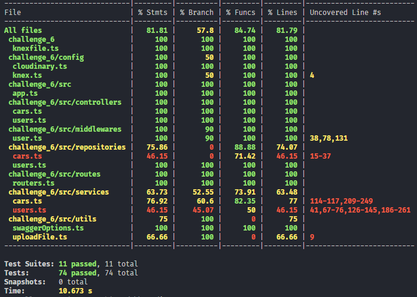
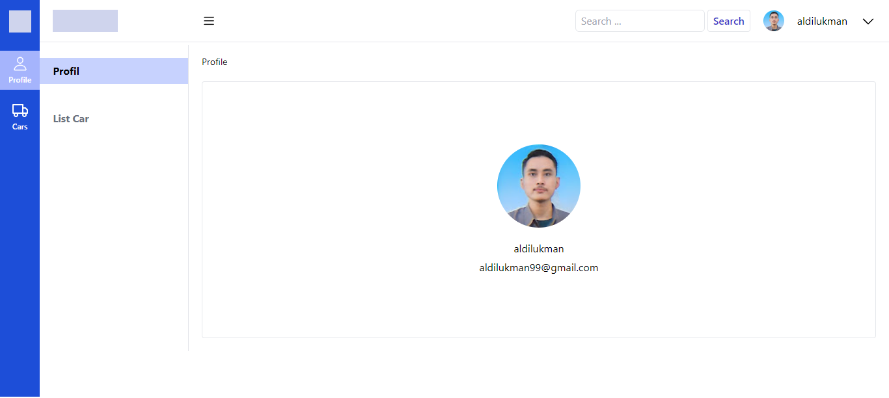
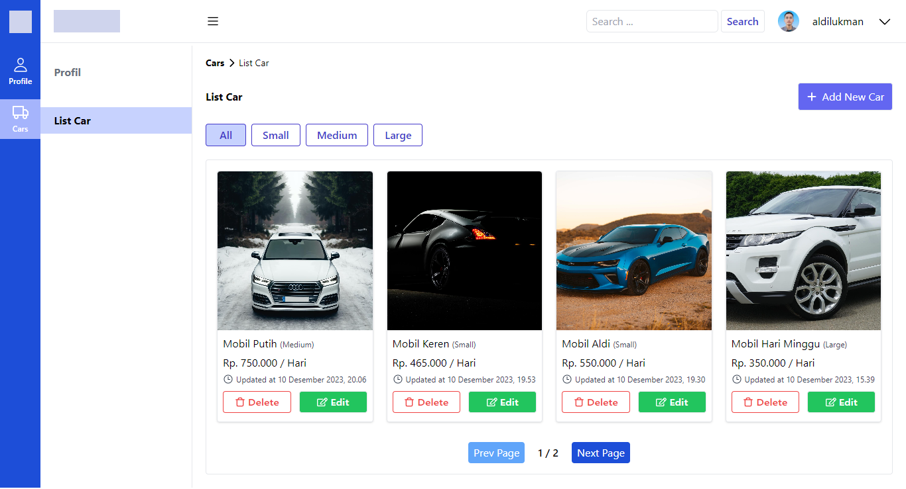
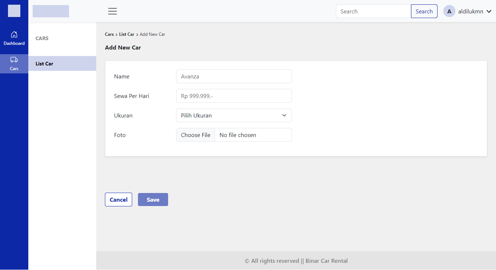
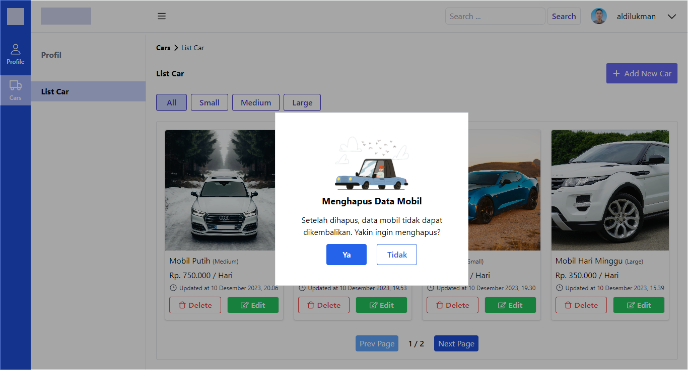

# Note

1. If you find an error after npm i / install then npm run dev on back/front end, just try to remove node_modules and package-lock.json and try npm i / install again

2. Deploy on railway with docker image and manage data with vercel postgres

# Public Access API

# Coverage Test

# Profil Page

# List Car

# New Car

# Update Car

# Delete Car

