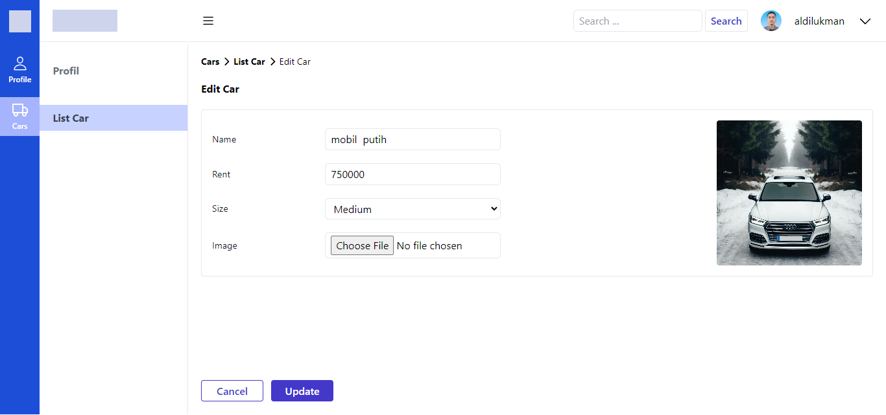

========FRONT-END========

# Dashboard

# List Car

# New Car

# Update Car

# Delete Car

========BACK-END========

=> LIST CAR || GET || http://localhost:8085/v1/cars

=> CREATE CAR || POST || http://localhost:8085/v1/cars

=> GET CAR || GET || http://localhost:8085/v1/cars/:id

=> UPDATE CAR || PATCH || http://localhost:8085/v1/cars/:id

=> DELETE CAR || DELETE || http://localhost:8085/v1/cars/:id